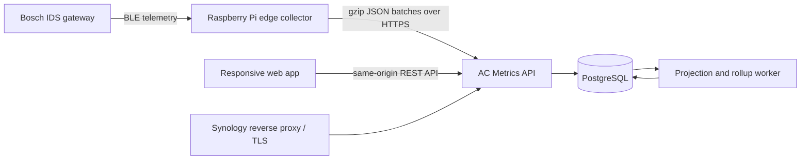
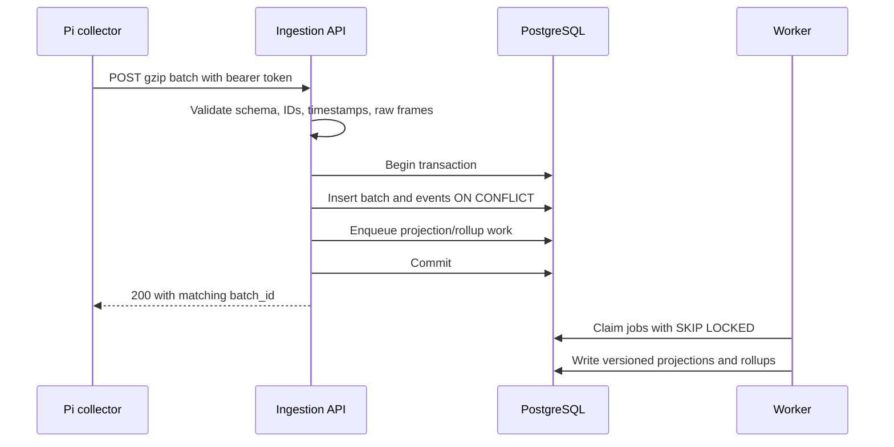

# Architecture

## System boundary

The Pi owns connectivity, frame validation, immediate safety classification,
and outage buffering. The Synology owns durable history, evolving decoding,
rollups, analysis, and presentation.

The Synology probes the Pi's read-only health endpoint hourly and on dashboard
load. It stores status transitions rather than repeated checks. This keeps LAN
traffic and NAS wakeups low while making the uncertainty explicit: when the NAS
is asleep, the last known state remains visible until the next successful check.
True immediate push notification for a total Pi outage requires a future
always-on observer outside both devices.

## Containers

The production Compose project will have three services:

| Service | Image | Responsibility |
| --- | --- | --- |
| `app` | Project image | FastAPI, ingestion, query API, and compiled web assets |
| `worker` | Same project image | Decoder backfills, rollups, cycle detection, maintenance |
| `db` | `postgres:16` | Durable relational and JSONB telemetry storage |

Using the same image for `app` and `worker` keeps deployment self-contained and
avoids a queue service. PostgreSQL tables provide job leasing and recovery. The
first release can run scheduled work in one worker process; Redis and Celery are
not justified yet.

## Request flow

The API never acknowledges before commit. A duplicate batch returns success
after verifying that its immutable identity and sample set match the previously
stored batch.

## API surface

Initial endpoints:

| Method and path | Purpose |
| --- | --- |
| `GET /health` | Process liveness; safe for Docker and Synology checks |
| `GET /ready` | Database/migration readiness |
| `POST /v1/telemetry/batches` | Idempotent Pi ingestion |
| `GET /api/v1/devices` | Registered collectors and latest state |
| `GET /api/v1/metrics/catalog` | Labels, units, confidence, and display groups |
| `GET /api/v1/series` | Multi-metric chart series with automatic resolution |
| `GET /api/v1/events` | Paginated raw/decoded event explorer |
| `GET /api/v1/faults` | Fault and urgent-event history |
| `GET /api/v1/system-summary` | Current status cards and recent cycle summary |

All browser APIs are same-origin. The ingestion token is separate from browser
authentication and grants only batch submission.

## Time-series strategy

Raw events remain append-only. Short chart ranges query raw projections;
longer ranges query precomputed 1-minute, 15-minute, hourly, or daily rollups.
The API chooses a resolution that targets at most roughly 1,500 points per
series, preventing the browser from downloading millions of samples.

PostgreSQL remains extension-free. A BRIN index on `captured_at`, ordinary
indexes on device/time and urgent events, and rollups are sufficient initially.
Monthly partitioning can be introduced if measurements show it is necessary.

## NAS availability and sleep

The system assumes the Synology can be unavailable at any time:

- The Pi retries the same idempotent batch and never deletes unacknowledged data.
- Wake-on-LAN and health polling are Pi deployment options, not requirements of
  the ingestion protocol.
- PostgreSQL and Container Manager activity can inhibit Synology disk
  hibernation. We must test the actual NAS rather than promise hourly ingestion
  will allow disks to sleep.
- Automatic NAS shutdown is deliberately out of scope for v1. It can be added
  only after proving that no ingestion, backfill, backup, or DSM job is active.

## Security and operations

- Store secrets only in an uncommitted `.env` or Docker secrets.
- Dashboard/API access uses a configurable single-user login and a signed,
  HTTP-only, SameSite=Strict session cookie. Passwords are stored only as salted
  PBKDF2-SHA256 hashes.
- Liveness/readiness and the independently bearer-authenticated Pi ingestion
  endpoint do not require a dashboard session.
- Compare the edge bearer token in constant time.
- Bind the application to the LAN; use DSM reverse proxy certificates for HTTPS.
- Run application containers as non-root and use read-only filesystems where
  practical.
- Apply database migrations before readiness succeeds.
- Pin image versions and support both `linux/amd64` and `linux/arm64` builds.
- Use structured JSON logs with bounded Docker rotation.
- Produce scheduled `pg_dump` backups into a separately mounted backup path and
  document restore testing.
