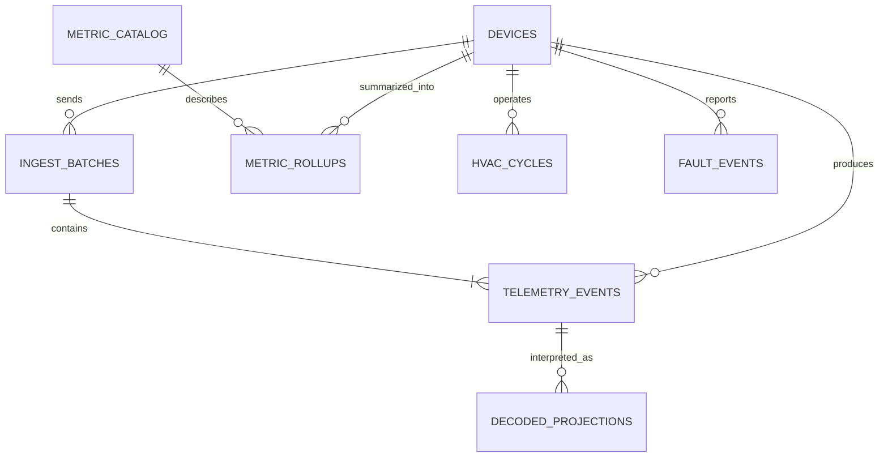

# Data model

## Modeling principles

The raw event and every interpretation are separate. This lets a future decoder
reclassify old Bosch words without mutating evidence or losing what the Pi
originally reported.

## Primary tables

### `devices`

- `device_id` text primary key; initially the normalized Bosch BLE address
- friendly name, location, model, serial number, timezone
- first/last seen timestamps
- current collector and decoder versions
- last boot ID and last health snapshot

### `ingest_batches`

- `batch_id` SHA-256 primary key
- `device_id`, upload schema version, collector version, delivery reason
- edge creation and server receipt timestamps
- declared and accepted sample counts
- payload digest for duplicate-consistency checks

### `telemetry_events`

- `event_id` SHA-256 primary key
- `device_id`, `batch_id`
- Bosch capture time, Pi receipt time, server receipt time
- Pi decoder version, urgent flag, and urgent reason
- `edge_metrics` JSONB containing the Pi interpretation
- immutable `raw_frame` bytea and its SHA-256 digest
- validation metadata

At five-second cadence this is approximately 17,280 events/day or 6.3 million
events/year per device. Based on the Pi measurements and additional PostgreSQL
overhead, plan initially for roughly 10–25 GB/device/year including indexes and
rollups; measure real usage before setting retention.

### `decoded_projections`

- composite primary key `(event_id, decoder_version)`
- decoded timestamp and decoder build identifier
- `metrics` JSONB
- optional `confidence` JSONB distinguishing confirmed, candidate, and derived
- decode status/error

The newest successful projection is used by default. Historical versions remain
queryable for audit and comparison.

### `metric_catalog`

- stable metric key, label, description, unit, value type
- category: operating, temperature, pressure, electrical, actuator, diagnostic
- confidence: confirmed, candidate, derived, unknown
- recommended chart, color, precision, and display order
- decoder version introduced/deprecated

Labels and units belong here rather than in frontend source code so the web app,
exports, alerts, and future mobile client use the same definitions.

### `metric_rollups`

One row per device, time bucket, and resolution. JSONB stores per-metric count,
minimum, maximum, average, and last value. Supported resolutions begin with one
minute, 15 minutes, one hour, and one day.

### `hvac_cycles` and `fault_events`

These are derived server artifacts. Cycles record start/end, mode, runtime,
compressor ranges, and thermal/pressure summaries. Fault events record the raw
code, mapped meaning, first/last observation, severity, acknowledgment state,
and decoder version that created the interpretation.

## Retention

- Raw telemetry is retained indefinitely by default on the server.
- Rollups are never a substitute for raw data until an explicit retention policy
  is adopted and backup capacity is understood.
- Re-decoding adds projections; it never rewrites `raw_frame` or `edge_metrics`.
- Database backups require their own retention and restore-test policy.
